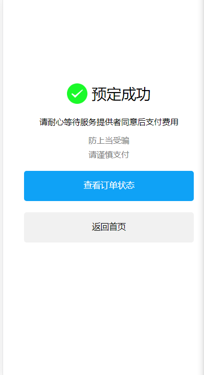

# 家政服务APP

## 项目描述

* 基于vue开发的家政服务APP，
* 展示已提供、正在找的服务。
* 发布评论
* 发起联系服务会话
* 预约项目
* 发布服务

## 技术要点

1. 使用vue-router实现前端路由
2. 使用less扩展css
3. 使用bable增强ES语法转换
4. axios发起HTTP请求
5. Vant移动端组件库
6. vue2
7. vue-cli

## 项目预览

### 首页


### 发布服务


### 消息中心


### 个人中心


### 服务详情


### 预约服务


### 预约成功页面



## 安装运行

1. node.js 12.0+
2. vue-cli 4.5+
3. vue 2.6+
4. os ：windows

   ```
   // 克隆代码
   git clone 
   // 切换到目录
   cd demestic-app
   // 安装依赖
   npm i
   // 启动项目
   npm run serve

   ```
